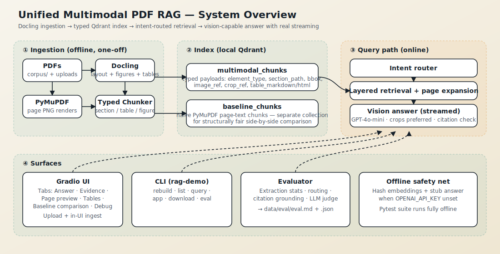

# 1 · Overview

## What is this project?

`rag-demo-unified` is a **local-first, end-to-end multimodal PDF RAG
pipeline**. You point it at a folder of PDFs and it lets you ask natural
questions; the answer comes back with a citation for every claim and, when
the question is about a figure or table, the vision-capable model sees the
actual crop — not just the OCR text.

The project also doubles as a *demonstration*: it runs a naive text-only
baseline in parallel, in a separate Qdrant collection, so you can judge how
much the typed / multimodal path is actually worth on your documents.

## What problem does it solve?

Research PDFs — arXiv papers, OECD / IMF / WHO / NASA reports — hide most of
their information in **charts, tables, and diagrams**. Off-the-shelf RAG
pipelines typically:

1. flatten the PDF into text,
2. chunk the text by length,
3. embed each chunk and stuff matches into a prompt.

That loses figures entirely and turns tables into ragged token soup. The
model has no way to "look at" Figure 1, so it either refuses or
hallucinates.

This project takes a different route:

- **Docling** parses the PDF into a typed document tree (sections, tables,
  pictures, captions) and persists cropped images for the figures and
  tables.
- Chunks are **typed at ingest time** (`section_chunk`, `table_chunk`,
  `figure_chunk`, `caption_chunk`, `page_fallback_chunk`) and that type
  survives through to retrieval.
- The retriever reads the question, infers whether it's asking about a
  table, a figure, both, or plain text, and runs **layered passes with
  different element-type filters**. The top results then expand to include
  the surrounding page text.
- The answerer attaches the relevant **figure / table crops** (not
  full-page PNGs when a crop exists) to the chat model and streams the
  answer a token at a time. Citations are parsed post-generation and
  cross-checked against the retrieved pages.

## What's *interesting* about it?

| Topic | What's non-obvious |
|-------|--------------------|
| **Two separate indexes** | The baseline path isn't a flag on the same chunks — it's a structurally different collection (`baseline_chunks`). This makes the comparison fair: you're not cheating by giving one side access to rich features. |
| **Intent-routed retrieval** | The retriever doesn't run one big vector search. It runs ordered passes, each with a different `element_type` filter, so table questions see tables first, figure questions see figures first, and the fallback pass still catches everything. |
| **Page expansion via scroll, not re-embed** | After the typed passes, it pulls the `page_fallback_chunk` for the top pages directly with a Qdrant `scroll` — no wasted embedding for a known anchor. The pulled chunks are demoted to score 0.45 so they never outrank typed evidence. |
| **Real token streaming** | `stream_answer()` is a generator that yields `(partial_text, None)` on every delta, then exactly one `(full_text, AnswerPayload)` at the end. The UI binds directly to the generator. |
| **Citation validation** | The LLM is prompted to emit `[doc_id, p.X]` citations; after generation, the regex is applied and every citation is matched against the retrieved evidence set. The UI shows a badge. |
| **Offline mode is a first-class path** | Missing `OPENAI_API_KEY` degrades to hash embeddings + an evidence-only stub. The full test suite runs here — no network, no Docling. |
| **In-UI ingestion** | Upload a new PDF from Gradio and it's chunked, embedded, and upserted into *both* collections, with stale rows (same `pdf_path`, different hash) purged first. The collections are *not* recreated — existing documents survive. |

## Who is this for?

- **ML / applied-AI engineers** stress-testing multimodal RAG recipes against
  real PDFs before committing to a production stack.
- **Researchers** who want a reproducible harness for "does vision actually
  help on this corpus?"
- **Developers** looking for a compact reference implementation of:
  typed Docling chunking, Qdrant dual-collection indexing, intent-routed
  retrieval, grounded vision answers, and streaming Gradio UIs.

## What it is *not*

- Not production-grade; the local Qdrant store holds a directory lock, and
  the eval is not yet regression-guarded in CI.
- Not a benchmark suite — the 10-doc corpus is a demo, and the benchmark
  questions are hand-written, not held-out.
- Not optimized for throughput; ingestion is single-process and Docling
  itself is the long pole.
