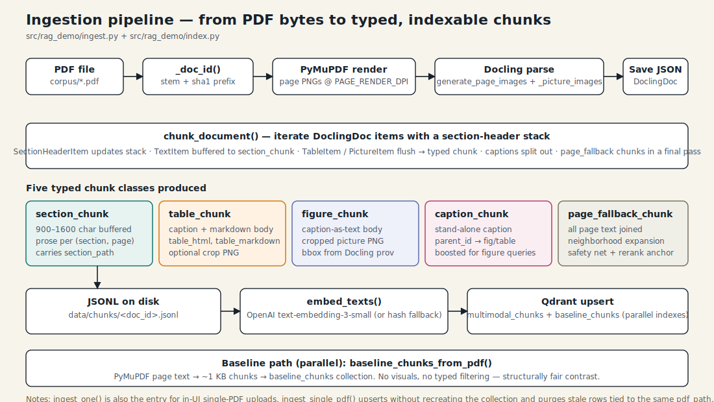
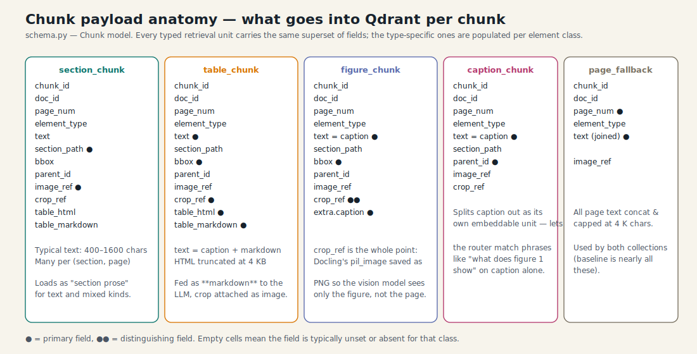

# 3 · Ingestion pipeline

Goal: turn a folder of PDFs into two ready-to-query Qdrant collections, with
on-disk artifacts that let you re-chunk without re-parsing.



## The five stages

### 1. Identify the doc

`ingest.py:95` hashes the raw PDF bytes to form a stable `doc_id`:

```python
stem + "_" + sha1(bytes)[:8]
```

Re-downloading a modified PDF produces a *different* `doc_id`, so the index
treats it as a separate document. `ingest_single_pdf()` takes care of
purging the stale rows tied to the same `pdf_path`.

### 2. Render pages (PyMuPDF)

`ingest.py:101` opens the PDF with PyMuPDF and saves each page as a PNG
(capped at `MAX_PAGES_PER_DOC`, default 60). Page images:

- are used for the **UI** Page Preview tab,
- are the fallback image sent to the vision model when a crop isn't
  available,
- live at `data/pages/<doc_id>/page_NNNN.png`.

PyMuPDF is used here — not Docling — because it's an order of magnitude
faster and doesn't need to do any layout analysis.

### 3. Parse with Docling

`ingest.py:119` builds a `DocumentConverter` with:

```python
PdfPipelineOptions(
    generate_page_images=True,
    generate_picture_images=True,
    generate_table_images=True,  # if supported
)
```

The `generate_picture_images` flag is the critical one — it's what makes
`item.image.pil_image` available for every `PictureItem` and `TableItem`.
Without it you can only serialize page images and lose the *cropped figure*
affordance that powers the multimodal answer path.

The parsed `DoclingDocument` is serialized to
`data/docling/<doc_id>.json` so re-chunking never needs to re-parse.

### 4. Typed chunking

`ingest.py:240 chunk_document()` walks the Docling items with a
**section-header stack** so every chunk inherits its full section path.

Five chunk classes come out:



The walk logic:

- `SectionHeaderItem` — flushes the buffered text, pops the stack to the
  right level, pushes the new header.
- `TableItem` — flushes buffer, exports markdown + HTML + caption, saves
  the cropped PNG, emits a `table_chunk`.
- `PictureItem` — flushes buffer, saves crop, emits a `figure_chunk`; if
  there's a caption, also emits a `caption_chunk` linked via `parent_id`.
- `TextItem` with label `caption` — emits a stand-alone `caption_chunk`.
- `TextItem` with label `page_header` / `page_footer` — **dropped** (noise).
- Other `TextItem`s — buffered into the current section until the buffer
  reaches `SECTION_CHUNK_TARGET_CHARS` (900 chars) or the page changes.

A second walk collects all per-page text into `page_fallback_chunk`s — one
per page, capped at 4 K chars.

### 5. Embed + upsert

`index.py:99` embeds the chunk texts in batches of 64, turns each into a
`PointStruct`, and upserts 128 at a time. The payload is the whole chunk
JSON (with `table_html` clipped to 4 K).

The baseline path (`ingest.py:459`) runs in parallel but completely
separately: PyMuPDF page text → ~1 KB chunks → `baseline_chunks`
collection.

## Rebuild vs single-doc ingest

Two entry points serve different use cases:

| Entry | Recreates collections? | Use |
|-------|------------------------|-----|
| `rebuild_index()` | yes | Full rebuild on CLI / make ingest |
| `ingest_single_pdf()` | no | UI upload — merges new chunks, purges stale doc_ids for the same path |

Single-doc ingest is what makes the **upload a PDF from the UI** button
safe: other documents stay in place.

## Offline caveat

Docling is an *optional* dependency at module-load time. If it's missing:

- `docling_available()` returns `False`.
- Ingestion fails with a clear message.
- Retrieval / answer / UI still import and run against a previously-built
  index.

The pytest suite side-steps this: it builds a synthetic PDF with PyMuPDF
and never calls Docling.
