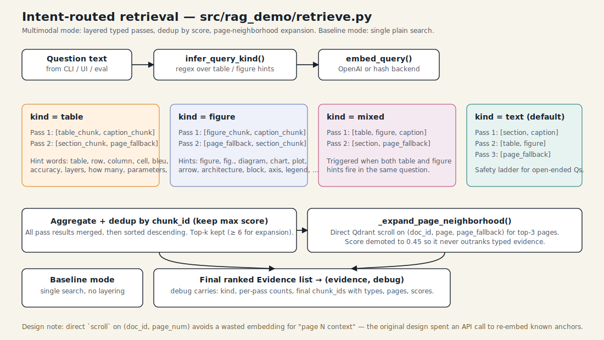

# 4 · Retrieval & routing

`retrieve.retrieve()` is the heart of the multimodal path. It turns a
natural-language question into a ranked list of `Evidence` objects and a
debug trace of how it got there.



## Query kinds

The router classifies each question into one of four *kinds* using two
keyword regexes (`retrieve.py:24`):

| Kind | Trigger | Intuition |
|------|---------|-----------|
| `table` | `table`, `row`, `column`, `value`, `bleu`, `accuracy`, `layers`, "how many", "how much", … | Numeric / tabular lookups. |
| `figure` | `figure`, `fig.`, `diagram`, `chart`, `plot`, `arrow`, `architecture`, `axis`, `legend`, `visual`, … | Visual reasoning questions. |
| `mixed` | both hint sets fire | "Which chart's numbers changed vs the table?" |
| `text` (default) | nothing fires | Generic prose / summarization. |

This is deliberately a regex, not a learned classifier:

1. It's transparent — you can open `retrieve.py` and see exactly why your
   question routed where it did.
2. It's zero-cost — adding a learned router would charge one extra model
   call per question.
3. It's easy to extend for a domain — add hints to the regex and rebuild.

## Layered passes

Each kind maps to a list of *ordered passes* over `element_type`
(`retrieve.py:48 _allowed_types_for`). Later passes widen the net.

```
table   → [table, caption] → [section, page_fallback]
figure  → [figure, caption] → [page_fallback, section]
mixed   → [table, figure, caption] → [section, page_fallback]
text    → [section, caption] → [table, figure] → [page_fallback]
```

Each pass runs a full Qdrant search with `limit=top_k` and the current
`element_types` filter. Results are accumulated across passes.

**Why layered instead of single?** Because a single search with no type
filter lets tall prose chunks out-rank a short but extremely relevant
caption or cell. Running caption-first gives figure-typed questions a
chance to surface the caption *first*, even if its vector similarity is
slightly lower than a verbose section chunk.

## Dedup + sort

`retrieve.py:72 _dedup()` collapses by `chunk_id` keeping the highest
score. Then a plain descending sort.

## Page-neighborhood expansion

After the typed passes, we pull the page-level fallback chunk for the
top-3 pages directly via a Qdrant `scroll`
(`retrieve.py:84 _expand_page_neighborhood`). The trick:

- `scroll` with a filter on `(doc_id, page_num, element_type="page_fallback_chunk")`
  returns the chunk we *already know we want*, without re-embedding.
- The returned evidence gets score `0.45` — guaranteed not to outrank typed
  evidence in the final re-sort.

This makes the LLM see *typed* evidence at the top plus a wider "context
around the page" in case the typed cells are too terse.

## Baseline mode

`retrieve.py:111` bypasses the router entirely for baseline mode — one
search, no filters, no expansion. This is what "naive RAG" looks like, and
it's what the evaluator compares against.

## Debug trace

Every call returns a `debug` dict with:

- `kind` — classifier result
- `passes` — `[{types, n}, …]` so you can see where each pass contributed
- `final` — list of `{chunk_id, type, page, score}` for the chunks actually
  returned

The UI's *Debug* tab renders this verbatim; the evaluator stashes it into
the per-question record.

## Tuning knobs

- `top_k` — defaults to 6, passed through from the UI / CLI. Raising it
  slows the answer model and inflates token cost.
- `_TABLE_HINTS` / `_FIGURE_HINTS` — regexes. Domain-specific vocabulary
  belongs here.
- Neighborhood expansion `max_extra` — caps the scroll results at 4 extra
  chunks, so the evidence list stays bounded.
- `SECTION_CHUNK_TARGET_CHARS` — upstream, in the chunker. Shorter section
  chunks mean more — and more targeted — retrieval candidates.
