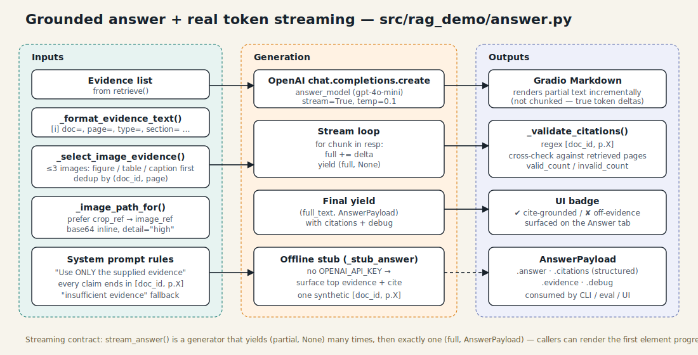

# 5 · Answering & streaming

`answer.py` turns ranked evidence into a user-facing answer with inline
citations, optional figure / table crops, and real token-level streaming.



## Prompt contract

The system prompt (`answer.py:29`) is short and strict:

```
You are a careful research assistant answering questions about PDFs.
Rules:
- Use ONLY the supplied evidence (text, tables, page images).
- Every factual claim must end with a citation in the form [doc_id, p.X].
- If the evidence is insufficient, reply:
    "Evidence is insufficient to answer confidently."
  and explain what is missing.
- Tables and figures may carry the answer — inspect images carefully.
- Keep answers concise (under 200 words unless depth is required).
```

Two things matter:

1. **Citation shape is fixed** — `[doc_id, p.X]` — so a regex can validate
   it post-generation.
2. **Refusal path is explicit** — the evaluator can measure
   "insufficient evidence" as a separate rate, not as failure.

## Building the user message

`answer.py:124 _build_messages()` assembles a single user message
containing:

1. The question and the mode (`multimodal` / `baseline`).
2. A text block formatted by `_format_evidence_text()`:
   ```
   [1] doc=resnet_a1b2c3d4 page=6 type=table_chunk section=Experiments / Benchmarks chunk_id=…
   <table caption>
   <markdown body>
   ```
3. Up to **three images**, chosen by `_select_image_evidence()`:
   - First pass: figure / table / caption chunks, dedup by `(doc_id, page)`.
   - Second pass: any remaining evidence with an image.
   - Crops are preferred over full-page renders
     (`_image_path_for` walks `crop_image_path → crop_ref → page_image_path
     → image_ref`).
   - Each image gets a small label caption explaining what it is.

Baseline mode skips images entirely even if the flag is on — the whole
point is to see the text-only answer.

## Real token streaming

`stream_answer()` is a generator:

```python
for partial_text, payload in stream_answer(question, mode, evidence):
    render(partial_text)         # progressively
    if payload is not None:
        commit(payload)          # exactly once, at the end
```

The protocol:

- `(partial, None)` many times as deltas arrive from OpenAI.
- Exactly one final `(full_text, AnswerPayload)` with citations + debug.

The Gradio UI wires directly to this generator so the Markdown widget
updates on every token. The CLI uses the blocking `generate_answer()`
instead, which is a thin wrapper that does not stream.

## Citation validation

`_validate_citations()` (`answer.py:183`) parses every `[doc_id, p.X]` in
the final answer text and:

- Maps `doc_id` to any retrieved doc_id that matches as substring (the
  model occasionally shortens `resnet_a1b2c3d4` to `resnet`, so the match
  is permissive).
- Checks that `p.X` is in the set of pages we actually retrieved for that
  doc.
- Records `{valid_count, invalid_count, cited: [...]}` on the payload's
  `debug`.

The UI reads this and displays a badge — green for "all citations
grounded", amber otherwise.

**Note**: this validates that the model *claimed to cite pages we
retrieved*. It does not validate that the claim itself is true. For that,
see [evaluation](06-evaluation.md) — the LLM judge scores groundedness
end-to-end.

## Offline mode

`_stub_answer()` kicks in when `OPENAI_API_KEY` is unset. It returns:

```
[OFFLINE MODE — no OPENAI_API_KEY set]

Top retrieved evidence (page 6, type=table_chunk):

> <excerpt>

[resnet_a1b2c3d4, p.6]
```

This gives you a fully functional UI without any network call — useful
both for demos and for wiring up retrieval-only tests.

## Why not function-calling / tool use?

Tool-use would let the model request more evidence on demand, but it
adds latency and removes the streaming guarantee (most tool-call UIs
pause on tool ticks). For a demo that wants to *show* grounded answers
arriving, a single shot with well-chosen evidence wins. The router
already picks the right evidence class before the LLM sees anything.
