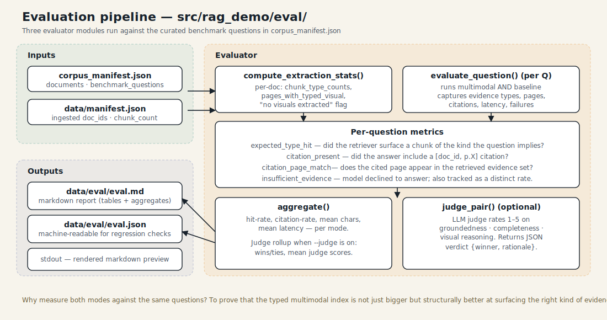

# 6 · Evaluation

The evaluator answers three questions:

1. **Extraction** — did Docling actually pull tables and figures out of each
   PDF, or did it silently miss?
2. **Routing + citation grounding** — does the pipeline surface the right
   kind of evidence and cite it?
3. **Answer quality (optional)** — which mode's answer is better, according
   to an LLM judge?



## Running it

```bash
uv run rag-demo eval --max-questions 1       # quick smoke test (cheapest)
uv run rag-demo eval                          # all benchmark questions, no judge
uv run rag-demo eval --judge                  # adds the LLM judge (extra $)
```

Outputs land in `data/eval/`:

- `eval.md` — human-readable report (also printed to stdout)
- `eval.json` — machine-readable, useful for regression diffing

## Metric 1: extraction stats

`eval/extraction.py:compute_extraction_stats()` reads the chunks JSONL for
each document and counts the chunk types. The report emits a table like:

```
| filename | pages | chunks | section | table | figure | caption | fallback | pages w/ visual | notes |
```

The **notes** column is the interesting one. If a doc produced zero
`table_chunk` and zero `figure_chunk`, it gets flagged — that's almost
always a sign that Docling didn't see what we'd want to ask about.

## Metric 2: per-question grounding

`eval/retrieval_eval.py:evaluate_question()` runs both modes for every
benchmark question and records:

| Field | What it means |
|-------|---------------|
| `expected_kind` | `table` / `figure` / `mixed` / `text` inferred from the question (independent of the router — a "label"). |
| `mm_inferred_kind` | What the multimodal router *actually* classified it as. Mismatches are the first thing to look at. |
| `mm_evidence_types` | List of chunk types retrieved (first pass or second, doesn't matter). |
| `mm_has_expected_type` | Did retrieval surface at least one chunk of the expected kind? |
| `mm_has_citation` | Did the answer emit any `[doc_id, p.X]`? |
| `mm_citation_page_match` | Do the structured citations point to retrieved pages? |
| `mm_text_citation_page_match` | Same, but parsed from the answer text. |
| `mm_insufficient_evidence` | Did the model refuse to answer? |
| `mm_seconds` | Wall time. |

Baseline has the same `bl_*` columns. The diff between them is the whole
point of the report.

## Metric 3: LLM judge (optional)

`eval/judge.py` asks the answer model (defaults to `gpt-4o-mini`) to score
both answers 1–5 on:

- **Groundedness** — does it stay tied to cited evidence?
- **Completeness** — does it actually answer the question?
- **Visual reasoning** — does it correctly use figure/table evidence?

It returns a JSON verdict `{multimodal_score, baseline_score, winner,
rationale}` and the aggregator rolls them up into `wins/ties/mean_score`.

This is opt-in (`--judge`) because it costs one extra call per question.

## Reading the report

Key rows in the **Aggregates** block:

```json
"multimodal": {
  "expected_type_hit_rate": 0.9,          // ← higher is better
  "citation_present_rate":  1.0,
  "model_emitted_citation_rate": 1.0,
  "insufficient_evidence_rate": 0.1,      // ← lower is better, but >0 is healthy
  "mean_answer_chars": 640,
  "mean_seconds": 3.2
},
"baseline": { ... }
```

The most honest signal is **`expected_type_hit_rate` delta between modes**.
If multimodal is 0.9 and baseline is 0.4, the typed index is paying for
itself. If they're equal, your questions may not be visual-heavy and
multimodal isn't buying you much on this corpus.

## Benchmark questions

Questions live in `files/corpus_manifest.json` under each document's
`benchmark_questions` array. They are hand-written to exercise the
multimodal path — e.g. "Compare ResNet-50 vs ResNet-152 layers" (a table
question) or "What does Figure 1 show?" (a figure question).

## Caveats

- Benchmark questions are *not held-out* — we design them knowing what's in
  the papers. They measure whether the system can surface known answers,
  not whether it generalizes to novel questions.
- The `expected_kind` label is also a regex (`_expected_kinds_for_question`)
  and can disagree with a human judgment on edge cases.
- Neither metric directly measures factual correctness — that's what the
  LLM judge approximates, and judges have their own biases.
