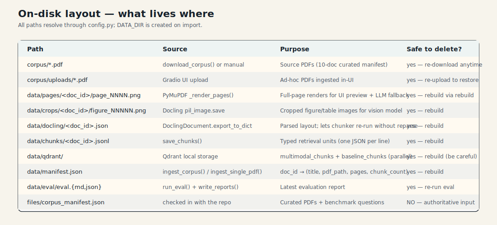

# 7 · Configuration & operations

## Environment variables

All optional; documented at `src/rag_demo/config.py`.

| Variable | Default | Notes |
|----------|---------|-------|
| `OPENAI_API_KEY` | — | If missing, hash embeddings + stub answers take over. |
| `EMBED_BACKEND` | `openai` when the key is set, else `hash` | Force `hash` for deterministic offline runs. |
| `EMBED_MODEL` | `text-embedding-3-small` | Must match `EMBED_DIM`. |
| `EMBED_DIM` | `1536` | Change both if you swap models. |
| `ANSWER_MODEL` | `gpt-4o-mini` | Vision-capable chat model. |
| `PAGE_RENDER_DPI` | `150` | Raise for sharper page PNGs (larger files). |
| `MAX_PAGES_PER_DOC` | `60` | Ingestion safety cap. |
| `MULTIMODAL_COLLECTION` | `multimodal_chunks` | Qdrant collection name. |
| `BASELINE_COLLECTION` | `baseline_chunks` | Qdrant collection name. |
| `GRADIO_SERVER_PORT` | `7860` | UI port. |

`.env` is auto-loaded via `python-dotenv`. `.env.example` ships the full
set.

## On-disk layout



Short version:

- `corpus/` — PDFs (curated + uploads). Safe to delete; re-downloadable.
- `data/` — everything derived. Safe to wipe; `rebuild` regenerates it.
- `files/corpus_manifest.json` — **authoritative**, do not delete.

## Make targets

```
make install       # uv sync
make env           # copy .env.example → .env
make download      # fetch the corpus
make ingest        # full rebuild
make app           # launch the Gradio UI
make list          # list ingested docs
make query Q='…'   # one-shot CLI query
make eval          # quick eval (1 Q per doc)
make eval-judge    # full eval with LLM judge
make test          # offline pytest
make clean-data    # wipe data/
make clean-corpus  # wipe corpus PDFs
make clean         # both
```

## CLI surface

```
rag-demo rebuild
rag-demo list
rag-demo query "What does Figure 1 show?" [--mode multimodal|baseline] [--docs id1,id2] [--top-k 6]
rag-demo app
rag-demo download [--manifest …] [--only file.pdf …] [--overwrite] [--report path] [--json path]
rag-demo eval [--manifest …] [--only …] [--max-questions N] [--top-k 6] [--judge] [--report …] [--json …]
```

## Offline mode

- Missing `OPENAI_API_KEY`:
  - `embed_backend` auto-flips to `hash`.
  - `answer.generate_answer()` returns a stub that surfaces the top
    evidence.
  - The UI still runs; the Answer tab shows a yellow badge noting the
    offline stub.
- Docling missing:
  - Ingestion fails with a clear error.
  - Retrieval / UI still load against a previously built index.

## Test suite

Tests live in `tests/`. They:

- Build a synthetic PDF with PyMuPDF in `conftest.py` (no real PDFs).
- Never import Docling — only the baseline and retrieval code paths.
- Run without network access.

```bash
uv run pytest -q
```

## Operational gotchas

- **Qdrant directory lock** — the local client holds an exclusive lock on
  `data/qdrant/`. The CLI and UI each `reset_client()` before heavy
  operations; if you hit a "locked" error, make sure no other process
  has the directory open.
- **`atexit` teardown** — `index.py:74` registers a `reset_client()` at
  exit to avoid a noisy shutdown traceback from `qdrant-client`'s own
  `__del__`.
- **`MAX_PAGES_PER_DOC`** applies to *both* the page render loop and the
  Docling `page_range` — the baseline chunker also respects it, so visuals
  and text stay aligned page-for-page.
- **OpenAI retries** — `embeddings.py:44` retries 3× with exponential
  backoff. No retry on the chat completion (one shot; failures surface as
  `[Generation failed: …]` in the answer).
